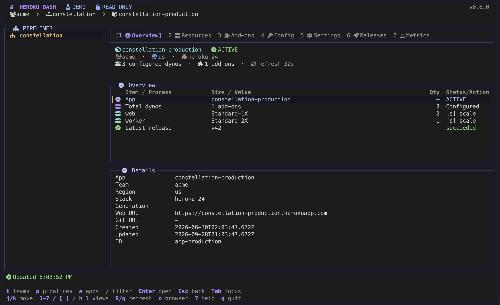
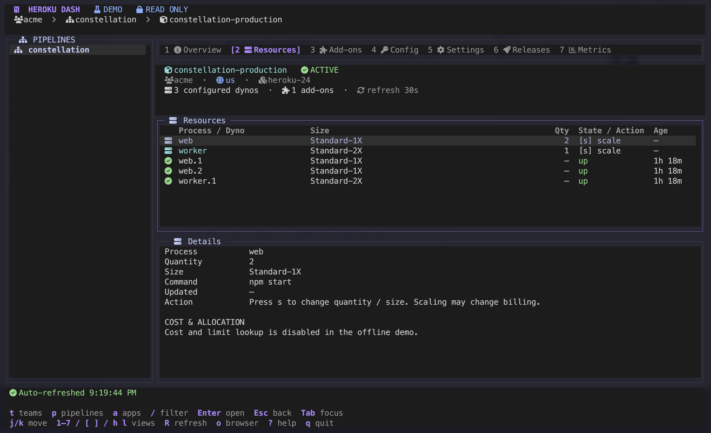
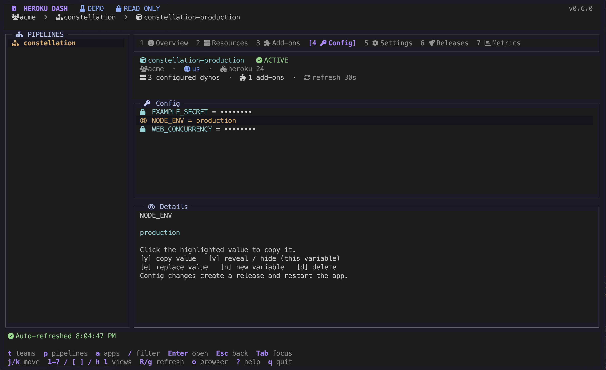
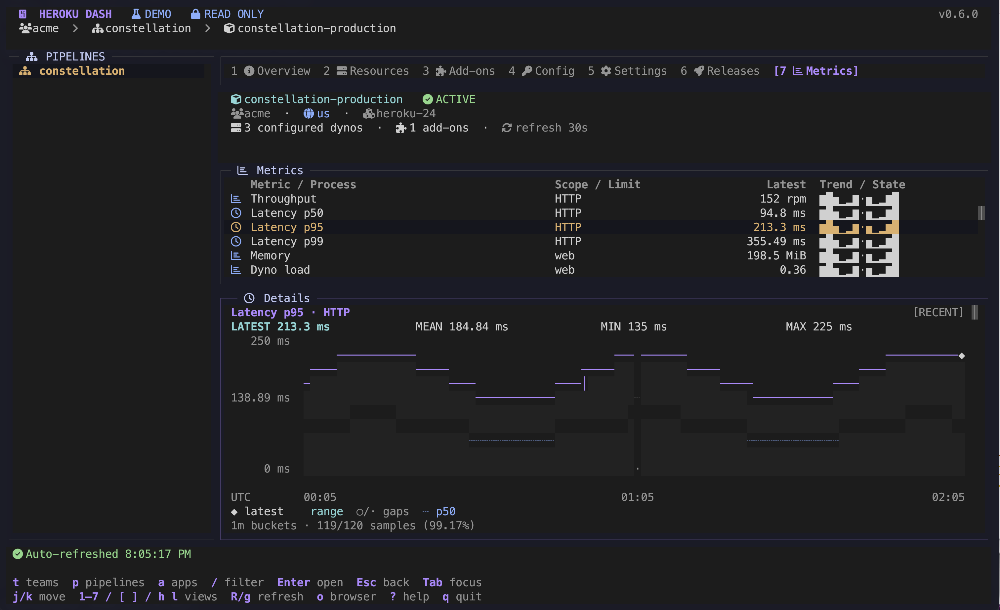

# heroku-dash

A keyboard-driven Heroku dashboard in your terminal, inspired by **gh-dash**.

Run **`heroku dash`** inside a Git repository to open its Heroku pipeline. Browse teams, pipelines, and apps; inspect resources and settings; scale dynos; and manage config without leaving your terminal.

   

## Installation

Requires a current [Heroku CLI](https://devcenter.heroku.com/articles/heroku-cli), Node.js 22+, and an interactive terminal. The minimum terminal size is 80 × 24; 120 × 36 or larger is recommended.

For the dashboard's icons, select a **[Nerd Font](https://www.nerdfonts.com/)** in your terminal settings. A **Nerd Font Mono** variant, such as **JetBrainsMono Nerd Font Mono** or **FiraCode Nerd Font Mono**, keeps icons aligned to the terminal grid. Missing or boxed icons usually mean the terminal is using an unpatched font.

```sh
heroku plugins:install heroku-dash
heroku dash
```

The plugin is installed from [npm](https://www.npmjs.com/package/heroku-dash) directly through the Heroku CLI.

Authentication uses your existing Heroku CLI login, including `HEROKU_API_KEY` when set. Run `heroku login` first if needed.

Try the offline demo without making any Heroku requests:

```sh
heroku dash --demo
```

Update installed Heroku plugins:

```sh
heroku plugins:update
```

Uninstall this plugin:

```sh
heroku plugins:uninstall heroku-dash
```

## Usage

```sh
heroku dash                            # Detect the current repository's pipeline
heroku dash --pipeline my-pipeline     # Pipeline name or ID
heroku dash --app my-app               # App name or ID
heroku dash --remote staging           # App attached to a specific Git remote
heroku dash --team my-team             # Start in a team
heroku dash --team my-team --pipeline my-pipeline
heroku dash --read-only                # Disable all remote changes
heroku dash --refresh 60               # Refresh the current app every minute
heroku dash --refresh 0                # Manual refresh only
```

`--app`, `--pipeline`, and `--remote` are mutually exclusive. `--team` can be combined with `--pipeline` when the pipeline belongs to that team: the team scopes the sidebar's pipelines and apps while the specified pipeline opens. Pipeline names are resolved within the chosen team. `--team` cannot be combined with `--app` or `--remote`. The default refresh interval is 60 seconds; nonzero intervals must be at least 10 seconds.

You can also set defaults with environment variables:

| Environment variable | Equivalent option |
| --- | --- |
| `HEROKU_DASH_TEAM` | `--team` |
| `HEROKU_DASH_PIPELINE` | `--pipeline` |
| `HEROKU_DASH_REFRESH` | `--refresh` |

Each explicit command-line option overrides its matching environment variable. Team and pipeline settings can be combined across CLI options and environment variables; for example, `HEROKU_DASH_TEAM` scopes an explicit `--pipeline`, and `HEROKU_DASH_PIPELINE` selects a pipeline within an explicit `--team`. An explicit `--app` or `--remote` overrides both environment-based context choices. Refresh values use the same validation as `--refresh`, including `0` to disable automatic refresh. Empty environment variables are ignored.

```sh
export HEROKU_DASH_TEAM=my-team
export HEROKU_DASH_REFRESH=120
heroku dash                            # Browse my-team; refresh every two minutes
heroku dash --pipeline my-pipeline --refresh 60  # Open my-pipeline within my-team
```

### Color themes

Dash automatically chooses a **light or dark theme** from your terminal's background color at startup. It queries the terminal using OSC 11, waits up to 200 ms, and falls back to `COLORFGBG` when available. If the background cannot be determined, it uses the dark theme.

Both themes include matching panels, selections, prompts, status colors, and metric charts. Light mode uses dark text on pale backgrounds with deeper purple and semantic colors for contrast. Focused selections keep the purple marker; unfocused selections are dimmed.

Use `--theme` to override detection, including in the offline demo:

```sh
heroku dash --theme light
heroku dash --theme dark
heroku dash --demo --theme light
```

`--theme auto` is the default. Restart dash after changing your terminal's color palette to detect it again.

### Repository detection

1. Explicit flags take precedence.
2. Detect Heroku HTTPS/SSH Git remotes, including named staging/production remotes and `heroku-accounts` SSH aliases. Look up each app's pipeline coupling.
3. If the remotes resolve to one pipeline, open its **pipeline overview**, rather than choosing a deployment implicitly.
4. Otherwise, match a pipeline to the **Git repository root directory name**, including when invoked from a subdirectory.
5. A single remote app without a pipeline opens directly. If no match exists, start in the workspace browser.

When remotes span multiple pipelines, the browser asks you to choose one. Use `--remote` to disambiguate. Duplicate pipeline names can be selected by ID with `--pipeline`.

A pipeline selected at startup through `--pipeline`, `HEROKU_DASH_PIPELINE`, or repository detection automatically selects its owning team, filtering the sidebar's pipelines and apps to that team. Personal pipelines keep the all-teams/personal scope.

### Workspace

The left sidebar browses teams, pipelines, or apps. Choosing a team scopes its pipelines and apps; **All teams / personal** clears the scope. Pipelines list apps ordered by stage. Open an app to see its seven views, with a selectable resource list above a scrollable details pane.

The pipeline apps pane uses aligned **Stage**, **App**, **Region**, and **Stack** columns with fixed headers. App names receive the available space; narrow layouts hide Stack. Full app names and stack values remain available in Details.

Pipeline app lookups run at most four at a time. Individual lookup failures appear as **Unavailable** rows with error details, while accessible apps remain usable. Press **R** to retry. Promotion requires all pipeline app details to load; unavailable apps are excluded from config-cloning source choices.

Switching apps keeps the selected tab, so moving from Metrics on one app opens Metrics on the next. The destination app's data loads automatically, including config vars and optional cost/limit details when those tabs are selected.

Navigating to another app or pipeline, replacing a pending read, or closing Dash cancels obsolete reads. Late results and errors cannot overwrite the active view or its status. Shared dyno-size lookups continue while another view still needs them.

Navigation remains available while app data loads: switch tabs, move between panes, or open another app. Pending tabs show a loading state, and completed reads preserve your pane focus. Config loads independently as soon as you select it; app panes do not wait for team and pipeline breadcrumb lookups.

App sections load in parallel and panes render as soon as their required sections finish. A slow releases, domains, or buildpacks lookup does not hold up Resources or Add-ons. Pending data is shown as loading rather than empty or zero, and costs and performance metrics can start loading before the rest of the app snapshot completes. Refreshes retain the previous snapshot until the new one finishes.

Revisiting an app immediately displays its last completed snapshot, labeled with its age, while a fresh snapshot loads in the background. This session-only cache holds up to eight apps for one minute and evicts the least recently visited app when full. Config values and revealed state are never cached across app switches. Confirmed changes invalidate the affected snapshots, including promotion destinations and apps targeted by custom CLI commands; quitting clears the cache.

Automatic refresh updates app status, formation, dynos, and recent releases at the configured interval. Pipeline coupling, add-on metadata, attachments, domains, and buildpacks refresh every five minutes; unavailable sections are retried on the next permitted refresh. Failed section reads retain their previous data with an error notice. Repeated failures slow background refresh exponentially, and rate limits honor `Retry-After` (or pause for at least a minute when absent). The status reports refresh pauses, including those caused by Metrics or resource lookups. Successful reads reset their own failure streak. **`R` remains a full refresh**, including config on its tab, and can be used during a background cooldown.

Single-click a tab's number, icon, or label to switch views and focus the resource list. This also works with compact tabs in narrow terminals. Clicking the active tab keeps the current selection and revealed config values.

Overview, Resources, Add-ons, Settings, and Metrics use aligned tables with fixed column headers and right-aligned quantities. Columns adapt to the terminal width; narrow layouts hide the Resources age and Add-ons service columns. Full values, including shortened names and hidden columns, remain available in Details.

Resources groups dynos directly beneath their process type, with indented names in natural order (`web.1`, `web.2`, `web.10`). Active process groups (Qty > 0) appear first, followed by **Other dynos** for one-off and unmatched instances, then inactive process groups (Qty = 0) at the bottom. Each group's child dynos stay with their process. Select a process row to scale, stop by scaling to zero, or restart all its dynos; select a child dyno to restart that specific instance.

The heading shows the resource hierarchy: **team › pipeline › app**, including when you open an app or pipeline directly. Personal resources use **Personal**, and apps without a pipeline use **No pipeline**. Once running, opening a resource resolves its parents without changing the sidebar's team filter.

Nerd Font icons identify teams, pipelines, apps, process types, databases, and the app views. **Green** indicates healthy/successful states, **amber** indicates pending states or maintenance, **red** indicates failures, and **gray** indicates inactive or unknown states. Keyboard shortcuts are highlighted in **purple** throughout the UI, including inline hints, selected rows, dialogs, and help. Config rows use a lock for masked values and an amber eye for revealed values. Status text remains visible alongside icons and colors.

Pipeline stages are color-coded: **blue** development, **purple** review, **amber** staging, and **green** production. The active view and focused pane use Heroku purple. Focused selections use a slim purple marker, with soft-white text on charcoal in dark mode or dark text on light gray in light mode. Unfocused selections are dimmed. On narrower terminals, inactive tabs show their number and icon; the active tab keeps its name.

While data is loading, an OpenCode-inspired purple scanner (`■` / `⬝`) sweeps back and forth in the status bar, with a fading trail and a brief pause at each turn. It updates every 40 ms alongside the operation in progress. It covers pipeline/app loads, config vars, workspace refreshes, and confirmed changes, and stops when the work finishes.

| View | What you can do |
| --- | --- |
| **1 Overview** | Inspect app identity, team, region, stack, URLs, formation, and latest release |
| **2 Resources** | Inspect process commands, desired quantity, dyno size, individual dyno states and ages; scale or stop processes and restart processes or dynos; optionally view costs and CPU/RAM allocations |
| **3 Add-ons** | Inspect services, plans, provisioning state, billing app, and local/shared attachments; optionally view billed costs and capacity limits |
| **4 Config** | View config keys; reveal or copy a selected value; create, replace, or delete variables |
| **5 Settings** | Add domains with optional ACM or remove custom domains; copy domain Hostname/CNAME values; inspect buildpacks, region, stack, and space; toggle maintenance mode |
| **6 Releases** | Inspect the latest 100 releases, including status, author, description, and timestamp |
| **7 Metrics** | View throughput, p50/p95/p99 response times, memory usage/quota, dyno load, and selectable-timeframe charts, alongside dyno health and recent deployment outcomes |

### Keyboard shortcuts

In **3 Add-ons**, select an add-on and press **`o`** to open its specific management dashboard. Heroku Postgres and Key-Value Store open the selected datastore’s Overview page in the Heroku Dashboard; third-party add-ons use Heroku’s management/SSO link to reach the provider’s dashboard. Shared third-party add-ons use the current app’s attachment link when available. This uses read-only metadata and works in `--read-only` mode.

| Key | Action |
| --- | --- |
| `t` / `p` / `a` | Browse teams / pipelines / apps |
| `A` / `Shift-A` | Create a new app in the selected pipeline workspace |
| `P` / `Shift-P` | Promote the selected pipeline app’s latest release to apps in a higher stage |
| `j` / `k`, `↑` / `↓`, `Ctrl-N` / `Ctrl-P` | Move selection down / up, or scroll the focused pane |
| `Enter` | Open the selected item |
| `Tab` / `Shift-Tab` | Focus the next / previous pane |
| `/` | Filter sidebar names; submit an empty filter to clear |
| `Esc` | Cancel a prompt or close keyboard help |
| `1`–`7` | Select an app view |
| `h` / `l`, `[` / `]`, `←` / `→` | Previous / next app view |
| `R` / `g` | Refresh the current app, pipeline, or workspace catalog |
| `Ctrl-L` | Redraw the terminal |
| `o` | Open the corresponding Heroku web page; in Add-ons, open the selected add-on’s management dashboard; in Metrics, open the selected process’s metrics |
| `?` | Show keyboard help |
| `q` / `Ctrl-C` | Quit (`q` closes help; `Ctrl-C` also exits from input prompts) |

App actions:

| Key | View | Action |
| --- | --- | --- |
| `s` | Overview / Resources | Scale the selected process row (server icon, `[s] scale`); enter quantity and select a dyno size available for the app |
| `x` | Resources | Stop the selected process type by scaling it to zero |
| `r` | Resources | Restart the selected process type or specific dyno |
| `v` | Config | Reveal / hide the selected value |
| `y` | Config | Copy the selected variable's full value to the clipboard, even when masked |
| `Y` / `Shift-Y` | Config | Clone non-`HEROKU_*` config vars from another pipeline app into the current app, only when its Config is empty |
| `e` | Config | Replace the selected variable's value |
| `n` | Config | Create a variable (or explicitly replace an existing key) |
| `x` | Config | Delete the selected variable |
| `m` | Settings | Toggle maintenance mode |
| `T` / `Shift-T` | Metrics | Cycle Past 2 hours (default), Past 24 hours, Past 72 hours, and Past 7 days |
| `D` | Settings | Add a custom domain and optionally enable SSL with ACM |
| `y` | Settings | Copy the selected custom domain’s CNAME to the clipboard |
| `x` | Settings | Remove the selected custom domain |
| `:` | Any app view | Run a custom Heroku CLI command scoped to the current app |
| `C` | Any app view | Open the default app console |
| `L` / `Shift-L` | Any app view | Open a live log viewer for the current app |

In every text prompt, `Enter` continues and `Esc` cancels. Readline-style editing supports `Ctrl-A` / `Ctrl-E`, `Ctrl-B` / `Ctrl-F`, `Ctrl-T`, `Ctrl-U` / `Ctrl-K`, `Ctrl-W` / `Ctrl-Y`, and `Alt-B` / `Alt-F` / `Alt-D`. `Ctrl-U` kills text to the left of the cursor; `Ctrl-Y` restores the last killed text. Config-value input is masked. Editing replaces the complete value and currently supports single-line input; existing multiline values can be inspected but should be edited through the standard CLI or web dashboard.

The release history is requested newest-first with a 100-release page limit and automatic pagination disabled. Dash also caps retained and displayed releases at 100, so long histories do not trigger additional release-page requests during refresh. Overview and Metrics use the same recent-release window.

### Live logs

Press **L** from any app view to open a scrollable log viewer. It runs `heroku logs --tail --num 100` scoped to the current app, using your existing CLI login, and works in `--read-only` mode. Log streaming is disabled in the offline demo.

- **p / Space** pauses or resumes the display. Scrolling up with **k / ↑ / Page Up / Ctrl-P** or the mouse also pauses following; **End** resumes at the latest logs.
- **/** opens a case-insensitive filter. Type text or a JavaScript regular expression directly—no prefix is needed (for example, `error`, `error|warn`, `status=5\d{2}`, or `app\[web\.\d+\]`). A line matches if it contains the literal query or matches the regex; invalid regex syntax falls back to literal matching. Press **Enter** to apply, **Esc** to cancel, or submit an empty filter to show all lines. Filtering works on the retained buffer's visible text and preserves ANSI styling.
- **↑ / ↓** or **Ctrl-P / Ctrl-N** in the filter field browses previous searches. Dash remembers the newest 100 nonempty filters per pipeline across sessions, shared by all apps in that pipeline and keyed by pipeline ID so renaming it preserves history. Apps outside a pipeline have separate app-specific histories. Only submitted filters are saved; canceled and empty filters are omitted. History is stored with user-only file permissions in the Heroku CLI config directory (`~/.config/heroku/dash/log-filter-history.json` on standard Unix setups); delete that file to clear it.
- **Esc / q** closes the viewer and stops streaming; **Ctrl-C** exits Dash. Switching apps or pipelines also stops the stream. If the stream ends, close the viewer and press **L** to reconnect.

The buffer retains at most **10,000 lines / 2,000,000 characters**. Pausing freezes the displayed snapshot while incoming logs continue into the bounded buffer; resuming shows its latest tail. Output updates are batched, ANSI colors and text styles are supported just like console output, and other terminal control sequences are removed. Filtering searches visible text rather than ANSI codes and gives matching substrings a theme-aware background with contrasting text. Original log colors are restored immediately after each match. Logs stay in memory only while the viewer is open.

## Remote changes and config values

In a pipeline workspace, press **`A`** to create an app. Choose development, staging, or production, enter a globally unique app name, and select a Common Runtime region fetched from Heroku. The summary shows the pipeline, stage, owner, and region and requires typing the new app’s exact name. Apps are created in the pipeline’s team (or your personal account for a personal pipeline), then added to that pipeline. The workspace refreshes and selects the new app. If pipeline attachment fails after creation, the app remains accessible and the status explains the failure. App creation is disabled in read-only and demo modes.

Press **`P`** on a selected pipeline app or from an app view to promote its latest release. Choose a populated higher stage in the development → staging → production sequence, review the destination apps, and type the source app’s exact name to confirm. Promotion deploys to all apps in the chosen stage and restarts their dynos. Dash tracks each destination’s status and reports deployment failures. Promotion is disabled in read-only and demo modes.

Every built-in write displays the target app and proposed change, then requires typing the **exact app name**. Scaling can change billing and restart dynos. The size selector shows RAM and reported vCPU allocation per dyno, including whether compute is shared or dedicated when that metadata is available. It includes Standard and higher tiers for the app's runtime regardless of its current size; Basic is selectable when the requested quantity is zero or one per process. Eco dynos are only offered for personal apps, not team-owned apps. Pressing `x` on a process scales it to zero; use `s` to scale it back up. Individual dynos can be restarted but not stopped through the dashboard because Heroku automatically replaces stopped formation dynos. Config changes create a release and restart the app. Maintenance mode affects request serving.

In **5 Settings**, press **`D`** (`Shift-D`) to add a custom domain. Enter the hostname, choose whether to enable app-wide Automatic Certificate Management (ACM) if it is currently disabled, then confirm with the exact app name. Configure DNS using the new domain’s CNAME; certificate issuance depends on correct DNS configuration. The Details pane highlights available **Hostname** and **CNAME** values in cyan—click either value to copy it, including wrapped portions. Domain copying also works in read-only mode. If the domain is created but enabling ACM fails, the domain remains added and the status explains the failure.

To remove a custom domain, select its Settings row and press **`x`**, then type the exact app name to confirm. The default Heroku domain cannot be removed. Settings refreshes after removal.

Press **`:`** while viewing an app to enter a Heroku CLI command without the leading `heroku`. Press `↑` / `↓` or `Ctrl-P` / `Ctrl-N` in the command field to browse commands previously run from any app. Dash keeps the newest 100 commands in the Heroku CLI config directory (`~/.config/heroku/dash/command-history.json` on standard Unix setups) with user-only file permissions; delete that file to clear the history. Dash rejects `-a` / `--app` and `-r` / `--remote`, then adds `--app` with the exact current app before executing. The command runs without a shell and shows **Continue (y)** and **Cancel (n)** buttons because custom commands can modify remote resources. Press `y` or `n` to choose immediately, or use `←` / `→` and `Enter`; Continue is selected initially. For installed commands whose metadata identifies `--confirm` as an app-name check, Dash supplies the current app and requires typing that exact app name once instead. Other `--confirm` flags can target resources such as databases, so they are never inferred. Output streams into a scrollable floating pane with ANSI colors and text styles preserved; unsafe terminal controls are removed. `Esc` or `q` closes the pane and stops a running command.

`heroku console` and `heroku run` commands use the terminal directly unless `--no-tty` is present, so interactive sessions such as `console`, `run console`, and `run bash` work normally. Exit the nested session with its usual command or `Ctrl-D`; once the child exits, the dashboard restores its screen and keyboard input. Custom commands are disabled in `--read-only` and demo modes.

`--read-only` blocks all non-GET requests at the plugin's API boundary, in addition to disabling mutation prompts. The offline demo also runs read-only.

Config values are fetched only when opening Config. Press `v` to reveal or hide the selected variable independently of the others. Moving between rows keeps revealed values visible, so you can inspect several at once. Switching views/apps or manually refreshing hides them all again. The plugin keeps fetched values in memory for the selected app and does not write config values to disk. Automatic refresh updates operational app data; use `R` to refresh config values.

Press **`y`** to copy the selected variable's value without revealing it. Revealed values appear in **cyan** in the Details pane; **click the highlighted value** to copy it. Clicking any wrapped or multiline portion copies the complete value. Empty values show a clickable `(empty value)` placeholder. Copying preserves whitespace, Unicode, and multiline content, and works in `--read-only` mode. The status bar confirms the variable name without displaying its value.

In **4 Config**, press **`Y`** (`Shift-Y`) to clone config vars **into the current app**, only when it has no config vars at all. Choose a source app in the same pipeline, review the variable count, and type the **current app’s exact name** to confirm. Following [Heroku’s config-copy guide](https://help.heroku.com/ZLU6JD4J/how-to-copy-config-vars-from-one-app-to-another), source `HEROKU_*` variables are excluded. The current app’s emptiness is checked again before applying the clone; any existing key, including a `HEROKU_*` key or an empty-string value, prevents cloning. Values are sent through a single JSON API update, preserving multiline values, whitespace, quotes, and empty strings without showing them in the dialog. The current app gets a release and restarts, and its Config view refreshes with values masked. This action is disabled in read-only and demo modes.

Clipboard access uses the system clipboard on the machine running `dash` (macOS, Windows, or a Linux desktop). On Wayland, install `wl-clipboard`; X11 uses `xsel`, with a bundled fallback. A desktop clipboard must be accessible to the terminal; headless/SSH sessions without one show a copy error instead.

## Optional costs and limits with heroku-resources

Install [heroku-resources](https://github.com/rmm5t/heroku-resources) alongside dash, then restart the dashboard:

```sh
heroku plugins:install heroku-resources
heroku dash
```

Dash detects the installed plugin automatically, including a locally linked checkout. It reuses the pricing, dyno specification, add-on limit, and pending-plan-change helpers from **heroku-resources 0.5.1**. The integration is optional: if the plugin is absent or its helpers are incompatible, the details pane explains why enrichment is unavailable.

- **Resources details:** RAM per dyno, total allocated RAM for a process, CPU allocation, estimated monthly process cost, and the per-dyno size rate. Scaled-to-zero processes are included. One-off dynos show a full-month size rate, not a claim about their actual charge.
- **Add-ons details:** billed price and billing app, active/billed plans, provider status, connection limit, RAM allocation, and disk capacity where supported. Postgres and Key-Value Store limits come from the companion plugin's service lookups; other services may have a price but no available limits.
- **Billing semantics:** prices are USD estimates, not invoices. Eco uses the shared account-level $5/month plan. Contract and metered prices are identified explicitly. Shared attachments identify their billing app. During plan changes, limits describe the active allocation while price reflects the billed plan.

Enrichment loads when you open **Resources** or **Add-ons**, using the current Heroku account and GET requests only, including in `--read-only` mode. It works for apps outside pipelines too. Direct helper reuse avoids fetching an entire pipeline stage via `heroku resources --json`.

Switching between views reuses the current app's fetched details. App refreshes refresh enrichment for the active resource view; dyno-size metadata is cached for five minutes. Press **`R`** to refresh immediately, including the size cache. Individual unavailable add-ons or limits don't block the rest of the dashboard. The offline demo does not perform these lookups.

## Performance metrics

The **Metrics (`7`)** view reads Heroku's separate **`api.metrics.heroku.com`** service using your existing CLI credentials and canonical app IDs. It uses GET requests only, including in `--read-only` mode. No feature flags, log drains, app instrumentation, or dyno restarts are needed.

| Metric | Display |
| --- | --- |
| Throughput | Requests/minute (`rpm`), derived from HTTP status-code counts; Details also shows requests/sec, observed request/error counts, and the observed 5xx rate |
| Response time | Latest completed-bucket p50, p95, and p99 latency in milliseconds, with maximum latency in Details |
| Memory | Mean RSS + swap usage in MiB (or reported mean used memory when that series is unavailable); Details includes matching-bucket quota, usage percentage, RSS/swap maxima, and total maximum |
| Dyno load | Mean one-minute load average per process type, with the bucket maximum in Details; this is runnable CPU work, **not CPU utilization percent** |

Rows include a compact sparkline. Select a row for a **colored, multi-line chart** in Details, with a value axis, UTC time labels, and latest/mean/min/max summaries. The Metrics layout gives Details extra vertical space, and charts resize with the terminal. Press **`T`** (`Shift-T`) in Metrics to cycle **Past 2 hours** (default), **Past 24 hours**, **Past 72 hours**, and **Past 7 days**. These use Heroku’s one-minute, ten-minute, one-hour, and two-hour resolutions respectively. Multi-day charts include dates on the UTC time axis. Basic/Hobby dynos use ten-minute buckets and have a 24-hour history limit; longer ranges show unavailable metrics for those dynos. Memory/load are fetched for active formation types and configured `web` processes, rather than for ephemeral one-off dynos.

Memory charts include the reported quota guide; p95/p99 latency charts compare against p50/p95 respectively; dyno-load charts include the bucket maximum. Details also includes sample and peak timestamps, resolution, coverage, and metric-specific breakdowns. Focus Details with `Tab` and use `j`/`k` to scroll the full report.

Metrics load on opening the tab and refresh with the current app while the tab is active. Reopening the tab within 30 seconds reuses its snapshot; **`R`** forces a fresh request. Changing the timeframe immediately fetches the new range and cancels any previous-range request. The selected timeframe is retained when switching apps during the session. Up to four requests run concurrently, and pending telemetry is canceled when changing apps or quitting. The offline demo supplies synthetic time series for each timeframe without network requests.

### Reading the charts

- Only complete buckets inside the requested window are included. The current/incomplete bucket is excluded.
- **Zero** is a measured value. **No samples** means the service returned no usable measurements; missing values are never silently converted to zero.
- `·` marks gaps in a sparkline. Larger time windows are condensed into groups of complete buckets.
- In the detail chart, `◆` marks the latest bucket at its midpoint. Filled columns have complete data; `○` marks a partial group and `·` marks a gap. The line uses the mean of available buckets per column, with `│` min–max whiskers to retain peaks when downsampling.
- Chart guides use matching time buckets: quota/load-max guides preserve their maximum, while percentile comparison guides use their mean. Axes include the guide's range, start at zero, and display memory in MiB. The time axis is UTC; full timestamps appear below the chart.
- **Stale** identifies a last reading older than two bucket durations, or a retained snapshot after a refresh failure. Details shows the sample time and any error.
- Statistics are computed over observed buckets. A mean of bucket p95 values is **not** the p95 of all requests over the entire window.
- Memory is aggregated by process type, not summed across replicas. Memory quota is a capacity limit; it isn't used as a substitute for measured usage.

Availability depends on app permissions, dyno tier, generation, and metric collection. Eco does not provide application metrics. Cedar dyno-load averages differ from Fir CPU usage; this version does not request a separate Fir CPU-utilization series. Endpoint failures appear alongside working metrics.

Press **`o`** on a memory, dyno-load, or process-health row to open that process type’s web metrics page (for example, `web` or `worker`). Throughput, latency, and app-wide summary rows open the app’s general metrics dashboard.

Platform snapshots remain below the performance rows: configured/healthy dyno counts, process state, and recent releases. `up` and `idle` formation dynos count as healthy, and one-off processes are excluded from formation health. During deploys, overlapping dynos can exceed the desired count.

Add-on provisioning/plan changes and buildpack edits are outside this version. App settings other than maintenance mode and custom domains are displayed read-only.

## Development and verification

Plain JavaScript ESM, an oclif/Heroku command, and Blessed terminal widgets. No application compilation step is required; `npm run build` generates the oclif command manifest.

### Local development

From a checkout of this repository:

```sh
npm ci
npm run build
heroku plugins:link .
heroku dash --demo
```

To switch from a development link to the npm release:

```sh
heroku plugins:unlink heroku-dash
heroku plugins:install heroku-dash
```

### Checks

```sh
npm run check             # Lint, automated tests, command manifest
npm pack --dry-run        # Inspect the publishable package
```

Tests use mocked transports and in-memory terminal streams. They cover repository resolution, pagination, partial API failures, read-only guards, confirmation validation, all three mutation paths, config masking, keyboard navigation, stale-response handling, and terminal cleanup.

### Publishing to npm

Run these commands from the repository root with Node.js 22+:

```sh
npm ci
npm publish --dry-run       # Run checks and inspect the package without uploading
npm login                  # Sign in to the npm account publishing the package
npm publish
```

`npm publish` runs lint and tests through `prepublishOnly`, then generates the command manifest through `prepack`. The package includes the runtime source, `oclif.manifest.json`, README, and MIT license. Development dependencies are needed to publish, but aren't required when installing the published plugin. Package access is explicitly public.

The current package version is **`heroku-dash@1.1.1`**. For subsequent releases, increment the version before publishing, for example:

```sh
npm version patch --no-git-tag-version
```

This updates `package.json` and `package-lock.json`. Update the current package version in this README too before committing, tagging, and publishing; npm does not allow publishing the same package version twice.

### Explicit read-only integration checks

These are opt-in and use the current Heroku CLI account:

```sh
npm run test:live -- ~/work/example-app ~/work/other-app
```

The live-check transport **rejects every method except GET**. It verifies repository-to-pipeline resolution and renders all seven app views, printing counts rather than config values. It reads every app in the detected pipelines.

To verify cost/limit enrichment with the installed `heroku-resources` plugin against specific apps:

```sh
npm run test:resources -- example-app-staging other-app-staging
```

This check also enforces GET-only access, including calls to Heroku's Postgres and Key-Value Store service APIs. It prints resource counts, without fetching config vars.

To verify the performance Metrics API against specific apps:

```sh
npm run test:metrics -- example-app-staging other-app-staging
```

This enforces GET-only access to the Platform and Metrics APIs and prints counts of usable telemetry buckets without fetching config vars.

After linking the plugin, macOS/Linux users with Python 3 can exercise the actual CLI in a pseudo-terminal:

```sh
python3 scripts/terminal-check.py
python3 scripts/terminal-check.py --repo ~/work/example-app
python3 scripts/terminal-check.py --repo ~/work/other-app
python3 scripts/terminal-check.py --repo ~/work/other-app --resources
python3 scripts/terminal-check.py --repo ~/work/example-app --metrics
```

Without `--repo`, this uses the offline demo. Live terminal checks always pass `--read-only --refresh 0`; mutation behavior is tested only with mocked APIs.

`--resources` also checks Resources/Add-ons cost details in the actual terminal UI; use a pipeline whose first app has dynos and add-ons, with `heroku-resources` installed.

`--metrics` also verifies numeric throughput and memory in the terminal UI. Use a pipeline whose first app has recent metrics, or run it without `--repo` to check the synthetic demo and cycle through all four Metrics timeframes.

### Layout

```text
src/commands/dash.js        Command flags, authentication, startup
src/project.js              Git context and pipeline resolution
src/hierarchy.js            Team and pipeline parents for resource breadcrumbs
src/api.js                  Platform API reads, pagination, guarded writes
src/resources.js            Optional adapter to the installed heroku-resources plugin
src/metrics.js              GET-only telemetry, bucket normalization, and statistics
src/ui/dashboard.js         Terminal navigation, prompts, refresh, lifecycle
src/ui/views.js             View models, config masking, operational metrics
src/ui/resource-details.js  Cost and capacity details and billing annotations
src/ui/telemetry.js         Performance metric rows, sparklines, and sample details
src/ui/details.js           Highlighted values and scroll-aware click targets
src/ui/theme.js             Light/dark palettes, Nerd Font icons, and styled labels
src/ui/terminal-theme.js    Terminal background detection and response filtering
src/ui/text.js              Terminal-safe text sanitization
src/demo.js                 Offline demo data
test/                       API, project, view, and keyboard integration tests
scripts/                    Explicit GET-only live and pseudo-terminal checks
```

## License

[MIT License](https://rmm5t.mit-license.org/)
